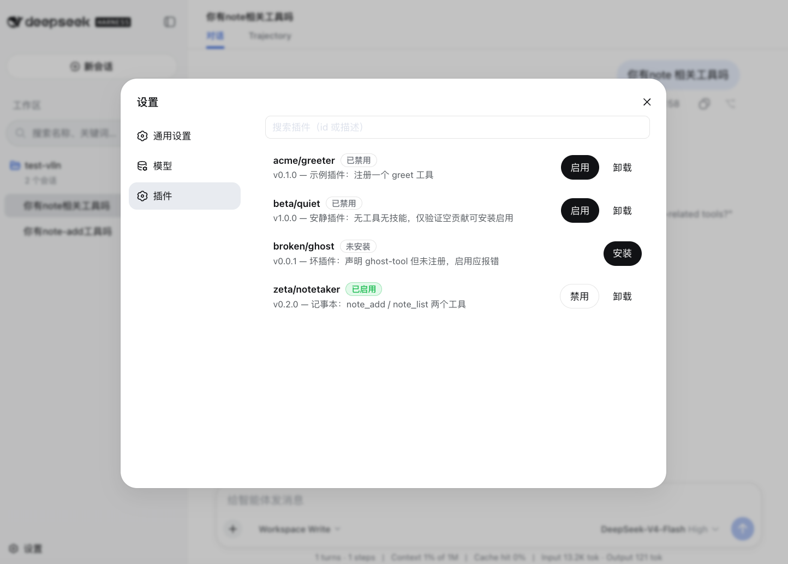
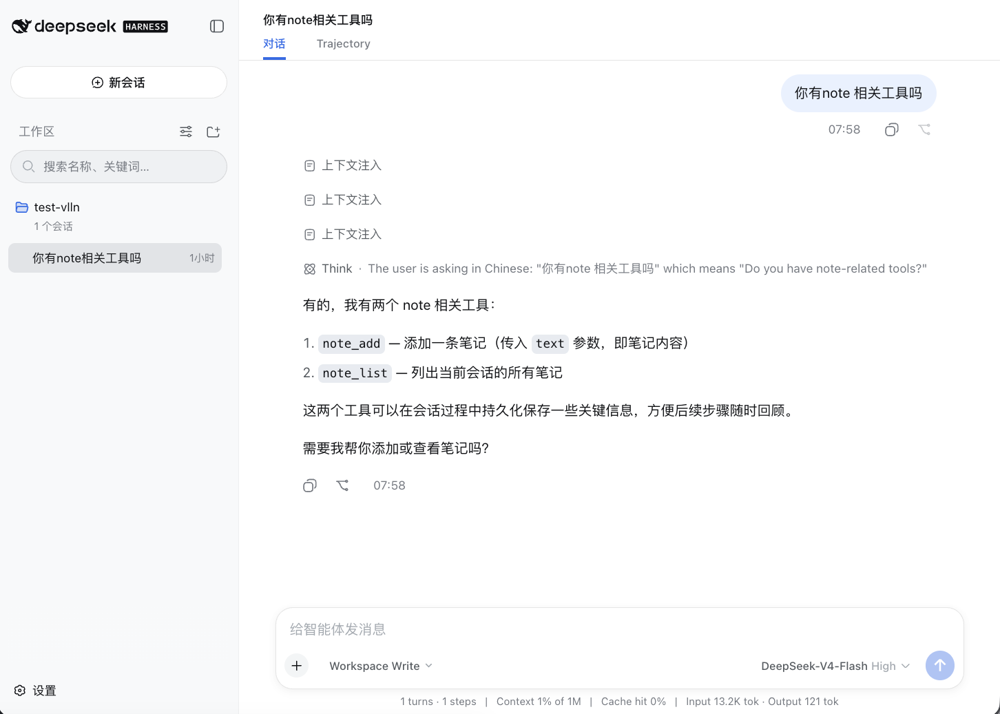

# dsh 插件注册表（Plugin Registry）

DeepSeek Harness 的本地插件系统：清单协议、安装/启停、Web 管理面板、声明校验、脚手架与 tarball 分发。

## 内容

| 目录 | 说明 |
|---|---|
| `packages/plugin/plugin` | 核心包 `@deepseek-ai/dsh-plugin`：清单协议、本地注册表、运行时服务、校验、脚手架、tarball 安装 |
| `packages/ui-plugin-manager` | Web 设置页插件面板：浏览 / 搜索 / 安装 / 启停 / 卸载 |
| `examples/greeter` | 可直接安装的示例插件（清单 + Cordis 入口），从零开发见 [`examples/README.md`](examples/README.md) |
| `skills/plugin-registry-create` | Agent Skill：指导快速创建 registry 插件（脚手架 → 写入口 → 安装启用） |

## 展示

Web 设置页「插件」面板：



插件列表：搜索框、状态徽章（已启用/已禁用/未安装）、版本与描述、操作按钮。



操作后状态：启用实时生效（徽章变绿胶囊）、禁用与卸载的反馈。

## 与 pi-mono 插件的对比

参考 [pi-mono](https://github.com/pi-mono) 的扩展机制做横向对比。

pi 的插件是：

- **Harness Extensions**（`harness-v2.md`）：events 观察 + hooks 拦截，可改 context / 请求 / 工具 / run 边界
- `.pi/extensions/*.ts` 本地脚本：放文件即加载，无管理

### 能力对比

| 维度 | pi-mono 扩展 | plugin-registry |
|---|---|---|
| 形态 | `.pi/extensions/*.ts` 本地脚本 | 清单 + Cordis 插件入口 |
| 接入 | harness events + hooks | inject 服务 + 注册工具/事件/服务/命令 |
| 事件/钩子拦截 | ✅ events + hooks | ✅ `agent/*`、`tools/*` waterfall（等价） |
| 工具/命令/提示词 | ✅ | ✅ `ctx.tools`/`commands`/`systemPrompt` |
| **TUI 修改** | ✅ 开放组件树 | ⚠️ 受限覆盖层 |
| 安装/发现 | 放文件即生效 | ✅ 安装/启停 + Web 面板 |
| 校验/兼容 | 无 | ✅ contributes 校验 + engines |
| 启停 | 无 | ✅ 默认禁用 + 实时热挂载 |
| 信任 | 直接执行 | ✅ 显式信任边界 |

TUI 差异补充：

- pi 开放 **pi-tui 组件树**（`ctx.ui.custom` 拿 tui 实例、注入组件、`ui.notify`）
- dsh 是**受限覆盖层**（`ctx.tui.openOverlay()` 只给 viewport/主题/重绘/关闭，不给底层树）——命令与事件驱动 UI 平齐，改主 UI 布局不如 pi 开放（安全取舍）

### 结论

- **能力面**：事件/钩子/工具/命令覆盖 pi，且补上 pi 没有的**安装-启停-校验-分发管理**
- **TUI 表面**：pi 开放组件树，dsh 受限覆盖层——命令与事件驱动平齐，改主 UI 不如 pi 开放
- **本质不同**：pi 是"代码扩展点"（零协议、放文件即用）；plugin-registry 是"带生命周期的分发生态"（清单 + 管理，换安全可控）

## 与 cordis.yml 插件的关系

本仓库在 dsh 的 cordis.yml 官方插件树之上**提供第二层插件**。

两层机制相同（都是 Cordis 插件：函数/类/带 apply 的对象 + inject/effect），**管理权不同**：

| 层次 | 定义 | 加载 | 管理 |
|---|---|---|---|
| **官方插件** | 产品随发布固定的组合（agent-loop、llm、tools、fs、skill-local、ui-* 等） | Loader 按配置树启动时静态加载 | 产品结构，随版本发布 |
| **第三方插件** | 用户安装的带 `dsh.plugin.json` 的插件 | `plugin-local` 扫描 `<dshHome>/plugins` 索引，运行时动态挂载 | 用户通过 `dsh plugin` / Web 面板管理 |

**边界：**

- 本仓库**不管理、不替换** cordis.yml 官方插件树——那是产品声明式组合
- 两层插件**互相可见**：第三方插件可 `inject` 官方树服务（`tools`、`skills`、`commands`…）
- 有意不做"统一管理"（registry 也管官方插件）：版本/更新、组合顺序、跨 surface 差异属产品层，且与在线市场路线重叠

### 加载路径：registry 插件不在 Loader 配置树里

| | 官方树（静态） | registry 插件（动态） |
|---|---|---|
| 来源 | cordis.yml entry | `<dshHome>/plugins` + `index.json` |
| 加载者 | Loader（配置驱动，启动时） | `plugin-local`（索引驱动，运行时） |
| 生命周期 | 随启动/配置 | `enable`/`disable`/`uninstall` |
| 进 Loader 树？ | 是 | 否（`ctx.plugin()` 动态挂载） |

后果：

- registry 插件**不出现在** cordis.yml / dump-config 的组合输出里
- `modules` 的 dshClient 扫描只看 Loader 树 → registry 插件的浏览器 bundle 不会进入 `__DSH_BOOT__`（client 插件应走独立 dshClient 包通道）
- 两者**同进程同 context**：registry 插件可 inject 官方树服务，官方插件可见它提供的服务

### 能力面 vs 声明面（contributes）

`contributes` 字段目前只有 `tools` / `skills`（仅 `tools` 做挂载时校验）——这是**校验范围**，不是**能力上限**。

registry 挂载的插件是完整 Cordis 插件，可注册：

- `ctx.tools` 工具、`ctx.skills` 技能提供者
- `ctx.on()` / `ctx.waterfall()` 事件监听（拦截、权限、审计）
- `ctx.provide()` / `Service` 子类提供**新服务** `ctx.xxx`
- `ctx.commands` 命令、`ctx.systemPrompt` 提示词、`ctx.settings` 配置、`ctx.tui` TUI 覆盖层…

示例：插件可注册 3 个工具 + 监听 `agent/request` + 提供新服务 + 注册 `/hello` 命令；`contributes` 只需声明 `{ "tools": [...] }`，其余能力"无声明但可用"。

### 服务的关系：registry 管插件，插件用服务

`ctx.tasks`（后台任务）、`ctx.workflows`（工作流引擎）等是 **官方树提供的服务**，不是 registry 管理的对象。

registry 插件是**消费者**：`inject: ['tasks']` 登记自己的后台任务、`inject: ['workflows']` 调用引擎。这些任务/运行由 tasks/workflows 管理，与 registry 无关。

### 新服务 vs 内置服务

- ✅ 可管理"**提供新 `ctx.xxx` 服务**"的插件（其他插件可 inject；enable/disable 即服务出现/消失）
- ❌ 不可管理/替换 dsh **内置** `ctx.xxx`（`tools`/`tasks`/`workflows`/`sessions`…）：官方树启动时提供，同名 `provide` 会注册冲突——属产品层

## 能力一览

- **清单协议**：`dsh.plugin.json` 声明身份、版本、入口、兼容范围、贡献
- **声明即契约**：声明的工具未注册 → 启用报错并回滚挂载
- **安装/启停**：目录或 tarball（解压防路径穿越）；启停实时生效
- **Web 面板**：设置页「插件」区，浏览、搜索、安装、启停、卸载
- **信任边界**：安装默认禁用，显式启用才执行
- **脚手架**：`dsh plugin create <id>` 一键生成标准插件根

## 集成到 DeepSeek Harness

前置条件：**DSH 源码环境**（官方 0804 快照 `20260804T143803Z` 或兼容布局，pnpm workspace）。
集成方式与社区其他扩展一致：**复制包 + git apply 补丁 + 组合启用**。

### 1. 放插件

把 `packages/plugin/`、`packages/ui-plugin-manager/` 复制到 DSH monorepo 对应路径（`packages/plugin/`、`packages/client/ui-plugin-manager/`）。

### 2. 打接线补丁

```sh
git apply patches/dsh-plugin-registry.patch   # 在 DSH monorepo 根目录执行
```

补丁基于官方 0804 快照生成，改动 30 个文件（CLI 子命令、apiproxy `plugins` 域、tsconfig、组合挂载、测试与 README），验证可干净应用。基线更新导致锚点漂移时，可 `git apply --3way` 或手动对齐。

### 3. 启用插件

```yaml
# base.cordis.yml（或你的组合）
- id: plugin-local
  name: '@deepseek-ai/dsh-plugin'
```

Web 组合再挂载面板：

```yaml
- id: ui-plugin-manager
  name: '@deepseek-ai/dsh-client-ui-plugin-manager'
```

`pnpm install` 后即可使用 `dsh plugin` 命令与 Web 设置页插件面板。

## 使用

```sh
dsh plugin create acme/cool-tool   # 脚手架
dsh plugin install ./cool-tool     # 安装（默认禁用）
dsh plugin install demo.tgz        # tarball 安装
dsh plugin enable acme/cool-tool   # 启用（实时挂载）
dsh plugin list                    # 列表
dsh plugin disable acme/cool-tool
dsh plugin uninstall acme/cool-tool
```

## 快速开发一个插件

```sh
dsh plugin create acme/cool-tool   # 在 ./cool-tool 生成 dsh.plugin.json + index.mjs + README
cd cool-tool
# 编辑 index.mjs 写插件逻辑；编辑 dsh.plugin.json 把 contributes.tools 声明成入口实际注册的工具
dsh plugin install . && dsh plugin enable acme/cool-tool
```

不想从空脚手架开始？直接复制示例：`cp -r examples/greeter ./my-tool`，改 `id` 与工具注册即可。完整从零指南见 [`examples/README.md`](examples/README.md)。

## Agent Skill

仓库自带 `plugin-registry-create` Skill（`skills/plugin-registry-create/SKILL.md`），指导 agent 快速创建 registry 插件：选 id → 脚手架 → 写 Cordis 入口 → 同步 `contributes` → 安装启用验证，含常见坑（默认禁用、声明面 vs 能力面、Loader 树边界等）。与官方 harness 的 `dsh-*` skills / `cordis` 工具集命名区分，避免混淆。

## 版权

本仓库代码版权归作者所有，供 dsh 内测成员在 dsh-external 组织内使用与协作。未经作者许可请勿公开分发。
