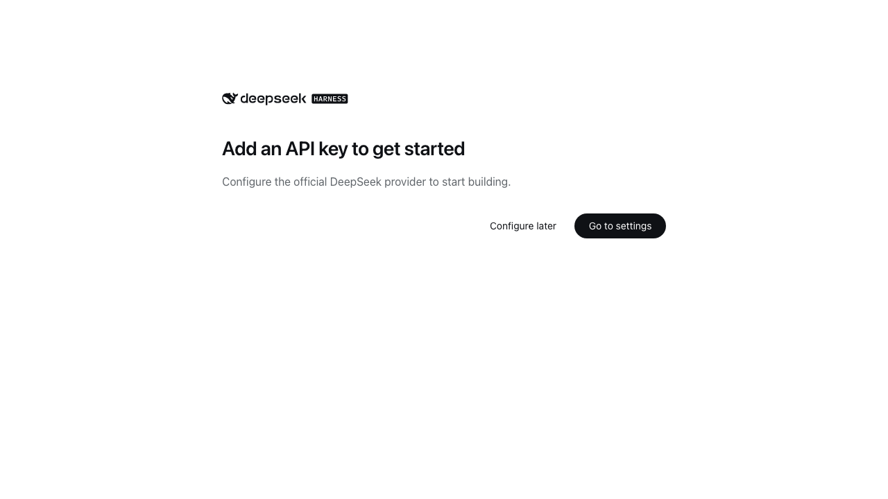

<h1 align="center">plugin-registry</h1>

<p align="center">
  <strong>DSH 插件生态基建：薄控制台 + 官方插件开发引导</strong><br/>
  浏览器面板管理 profile 插件安装态（bundle 层栈 + insert 行 + 启停），零补丁；
  `make-dsh-plugin` skill 引导开发者按官方格式写插件。
</p>

<p align="center">
  
  
</p>

---

> **转向（2026-08）**：官方 0809 推出仓库插件机制（`.dsh-plugin`）覆盖旧独立机制 ~95%，本仓库收敛为
> **薄控制台 + 插件开发规范和引导**（旧 patch/CLI/面板已移除）。**0811 起官方删除
> repository-plugins 机制**（`vendor/loader/src/repository.ts`），外部插件统一经 web profile 安装：
> bundle 插件（`dsh.bundle` 包）进 `dsh.profile.bundles` 层栈；非 bundle 插件（纯 cordis 包）经
> profile `cordis.patch.yml` insert 行挂载（配置 HMR 实时生效）。完整评估见 [官方 0809 覆盖度](docs/official-0809-coverage.md)。

## 定位

DeepSeek Harness 官方机制管「插件是什么、怎么跑」；本仓库补两件事（面板结构见 [console README](packages/plugin/console/README.md)，开发引导见下文）：

1. **薄控制台**（`packages/plugin/console`）——管理 profile 插件安装态的浏览器面板 + 4 个 agent 工具
2. **开发规范和引导**——`make-dsh-plugin` skill + cookbook，指导创建官方 bundle / cordis 插件

## 生态关系（谁能干什么）

```
官方 DSH（DeepSeek Harness）     插件运行时 + profile bundle 机制（0811 起无 repository 机制）
   │
   ├── 官方插件（bundle）        loop / task-status / navbar 等——`dsh plugin --profile web add` 装进 profile 层栈
   ├── 第三方插件（bundle/纯插件）独立 GitHub 仓库或 npm 包——bundle 进层栈；纯插件走 insert 行（实时）
   │
   └── 本仓库（plugin-registry） ① 薄控制台：管理安装态的浏览器面板 + agent 工具
                                ② make-dsh-plugin skill + cookbook：引导开发第三方插件
```

插件形态与安装路径说明见 [插件类型对比](docs/plugin-types.md)；现有插件的安装示例见 [examples](examples/README.md)。

## 薄控制台



设置页「插件」面板管理 profile 插件安装态：**insert 插件区**（非 bundle 插件实时挂载/移除，配置 HMR 零重启）+ **已加载插件区**（`disabled` 启停持久化 + bundle 更新/卸载）+ **bundle 安装区**（pnpm add + 层栈 reconcile）。

## 安装

**方式一：git 源直接安装（推荐，真一行）**

```sh
dsh plugin --profile web add "github:vlln/plugin-registry#main&path:/packages/plugin/console"
```

构建产物已入库（git 源安装不触发构建），一行命令直接装（实测约 15 秒）。

**方式二：本地目录（有源码时）**

```sh
git clone https://github.com/vlln/plugin-registry
cd plugin-registry/packages/plugin/console
dsh plugin --profile web add .   # 产物已入库，无需构建；当前目录即 bundle 包子目录（dsh 锚定 . 为绝对路径）
```

挂载后刷新 Web 页面，设置页出现「插件」面板。

## Agent Skills

| Skill | 作用 |
|---|---|
| [make-dsh-plugin](skills/make-dsh-plugin/SKILL.md) | 创建官方 bundle / cordis 插件：先选形态（skill 包 / MCP / Node 工具 / 带 UI）→ 声明 `dsh.bundle` 或纯 apply → 安装验证纪律。详情分置 `references/`；仓库内参考实现 `packages/plugin/console` |

## 开发前须知（踩过的坑）

关键坑（官方包未发布、Node half 改动需重启、宿主 CSS 覆盖等）与完整清单见 [skill references/gotchas](skills/make-dsh-plugin/references/gotchas.md)——**开发前先读**。

## 文档

- [插件类型对比](docs/plugin-types.md) — bundle 插件 vs 纯 cordis 插件：开发/分发/安装/管理四维 + 选型
- [官方 0809 覆盖度评估](docs/official-0809-coverage.md) — 官方机制覆盖度、转向决策（含 0811 repository 移除说明见 CHANGELOG）
- [薄控制台设计](docs/console-ui-plugin-management.md) — 统一管理安装态的设计
- 历史机制文档（已转向，仅存档）：[架构（旧）](docs/architecture.md)、[创建插件（旧）](docs/cookbook/creating-a-plugin.md)、[清单格式（旧）](docs/manifest-format.md)、[创建 repository-plugin（旧）](docs/cookbook/creating-a-repository-plugin.md) 等
- [变更记录](CHANGELOG.md) / [路线图](ROADMAP.md)

## 版权

MIT License。见 [LICENSE](LICENSE)。
